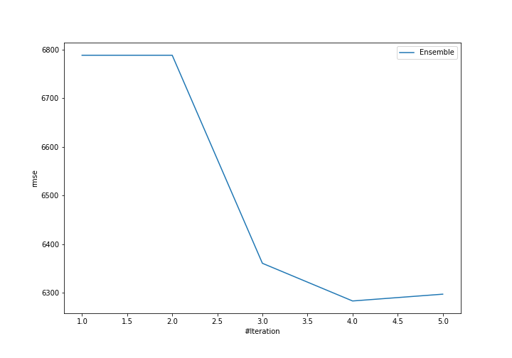
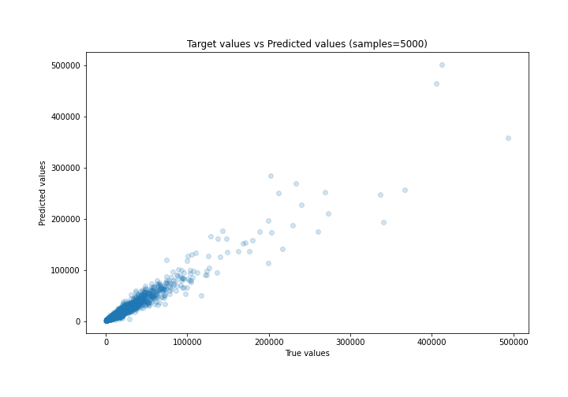
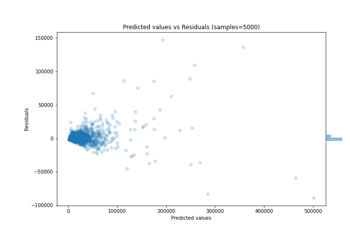

# Summary of Ensemble

[<< Go back](../README.md)

## Ensemble structure
| Model             |   Weight |
|:------------------|---------:|
| 2_DecisionTree    |        1 |
| 3_Default_Xgboost |        3 |

### Metric details:
| Metric   |         Score |
|:---------|--------------:|
| MAE      | 2368.54       |
| MSE      |    3.9482e+07 |
| RMSE     | 6283.47       |
| R2       |    0.928735   |
| MAPE     |    0.750378   |

## Learning curves

## True vs Predicted

## Predicted vs Residuals

[<< Go back](../README.md)
