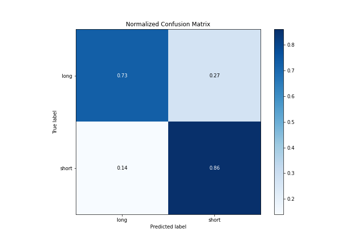

# Summary of 2_DecisionTree

[<< Go back](../README.md)

## Decision Tree
- **n_jobs**: -1
- **criterion**: gini
- **max_depth**: 3
- **explain_level**: 2

## Validation
 - **validation_type**: split
 - **train_ratio**: 0.75
 - **shuffle**: True
 - **stratify**: True

## Optimized metric
logloss

## Training time

24.5 seconds

## Metric details
|           |    score |   threshold |
|:----------|---------:|------------:|
| logloss   | 0.4556   |  nan        |
| auc       | 0.850849 |  nan        |
| f1        | 0.831538 |    0.438215 |
| accuracy  | 0.802126 |    0.547274 |
| precision | 0.947368 |    0.832699 |
| recall    | 1        |    0.12748  |
| mcc       | 0.60011  |    0.438215 |

## Metric details with threshold from accuracy metric
|           |    score |   threshold |
|:----------|---------:|------------:|
| logloss   | 0.4556   |  nan        |
| auc       | 0.850849 |  nan        |
| f1        | 0.828061 |    0.547274 |
| accuracy  | 0.802126 |    0.547274 |
| precision | 0.795094 |    0.547274 |
| recall    | 0.863879 |    0.547274 |
| mcc       | 0.598828 |    0.547274 |

## Confusion matrix (at threshold=0.547274)
|                  |   Predicted as long |   Predicted as short |
|:-----------------|--------------------:|---------------------:|
| Labeled as long  |                1440 |                  543 |
| Labeled as short |                 332 |                 2107 |

## Learning curves

## Decision Tree 

### Tree #1

### Rules

if (Total Costs > 9078.685) and (Type of Admission > 0.5) and (Total Charges > 21268.5) then class: long (proba: 85.84%) | based on 4,123 samples

if (Total Costs <= 9078.685) and (Total Costs <= 4889.275) and (CCS Diagnosis Code <= 654.0) then class: short (proba: 95.29%) | based on 3,376 samples

if (Total Costs <= 9078.685) and (Total Costs > 4889.275) and (CCS Diagnosis Code <= 253.5) then class: short (proba: 71.25%) | based on 3,033 samples

if (Total Costs > 9078.685) and (Type of Admission <= 0.5) and (Total Costs <= 23891.601) then class: short (proba: 64.61%) | based on 1,088 samples

if (Total Costs > 9078.685) and (Type of Admission <= 0.5) and (Total Costs > 23891.601) then class: long (proba: 75.26%) | based on 489 samples

if (Total Costs > 9078.685) and (Type of Admission > 0.5) and (Total Charges <= 21268.5) then class: short (proba: 54.09%) | based on 416 samples

if (Total Costs <= 9078.685) and (Total Costs <= 4889.275) and (CCS Diagnosis Code > 654.0) then class: short (proba: 65.78%) | based on 374 samples

if (Total Costs <= 9078.685) and (Total Costs > 4889.275) and (CCS Diagnosis Code > 253.5) then class: long (proba: 83.61%) | based on 366 samples

## Permutation-based Importance

## Confusion Matrix

## Normalized Confusion Matrix

## ROC Curve

## Kolmogorov-Smirnov Statistic

## Precision-Recall Curve

## Calibration Curve

## Cumulative Gains Curve

## Lift Curve

## SHAP Importance

## SHAP Dependence plots

### Dependence (Fold 1)

## SHAP Decision plots

### Top-10 Worst decisions for class 0 (Fold 1)

### Top-10 Best decisions for class 0 (Fold 1)

### Top-10 Worst decisions for class 1 (Fold 1)

### Top-10 Best decisions for class 1 (Fold 1)

[<< Go back](../README.md)
