# Summary of 3_Default_Xgboost

[<< Go back](../README.md)

## Extreme Gradient Boosting (Xgboost)
- **n_jobs**: -1
- **objective**: binary:logistic
- **eta**: 0.075
- **max_depth**: 6
- **min_child_weight**: 1
- **subsample**: 1.0
- **colsample_bytree**: 1.0
- **eval_metric**: logloss
- **explain_level**: 2

## Validation
 - **validation_type**: split
 - **train_ratio**: 0.75
 - **shuffle**: True
 - **stratify**: True

## Optimized metric
logloss

## Training time

25.2 seconds

## Metric details
|           |    score |    threshold |
|:----------|---------:|-------------:|
| logloss   | 0.262653 | nan          |
| auc       | 0.957581 | nan          |
| f1        | 0.901357 |   0.456346   |
| accuracy  | 0.889869 |   0.456346   |
| precision | 1        |   0.998039   |
| recall    | 1        |   0.00024779 |
| mcc       | 0.777034 |   0.456346   |

## Metric details with threshold from accuracy metric
|           |    score |   threshold |
|:----------|---------:|------------:|
| logloss   | 0.262653 |  nan        |
| auc       | 0.957581 |  nan        |
| f1        | 0.901357 |    0.456346 |
| accuracy  | 0.889869 |    0.456346 |
| precision | 0.890713 |    0.456346 |
| recall    | 0.912259 |    0.456346 |
| mcc       | 0.777034 |    0.456346 |

## Confusion matrix (at threshold=0.456346)
|                  |   Predicted as long |   Predicted as short |
|:-----------------|--------------------:|---------------------:|
| Labeled as long  |                1710 |                  273 |
| Labeled as short |                 214 |                 2225 |

## Learning curves
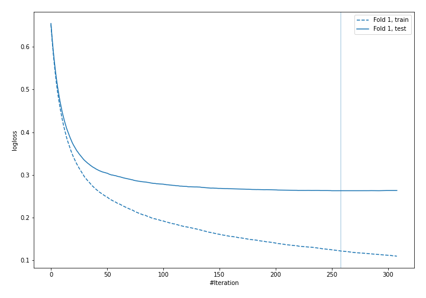

## Permutation-based Importance
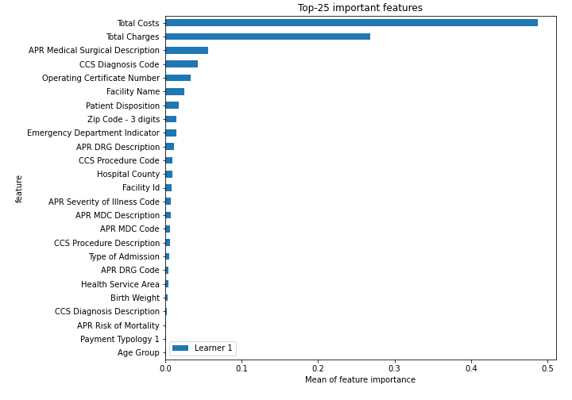
## Confusion Matrix

## Normalized Confusion Matrix

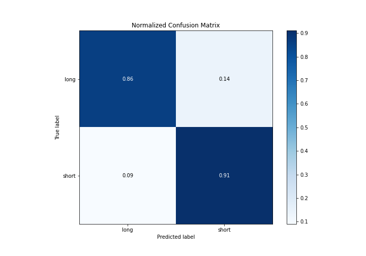

## ROC Curve

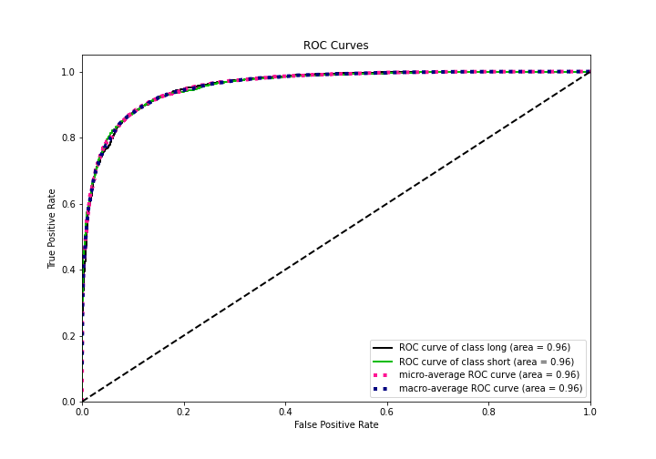

## Kolmogorov-Smirnov Statistic

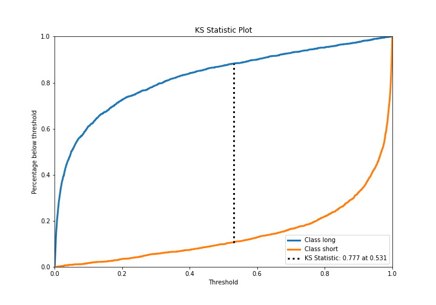

## Precision-Recall Curve

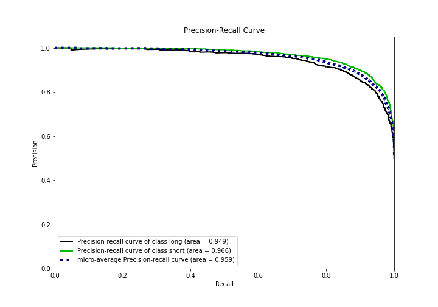

## Calibration Curve

## Cumulative Gains Curve

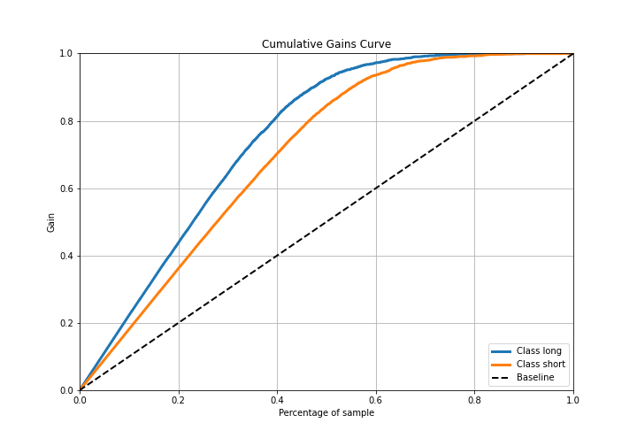

## Lift Curve

## SHAP Importance
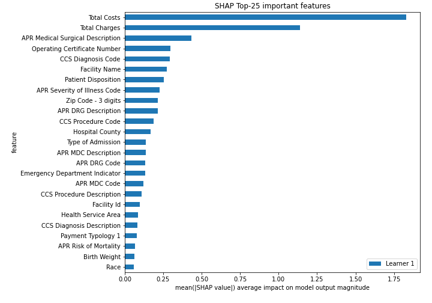

## SHAP Dependence plots

### Dependence (Fold 1)
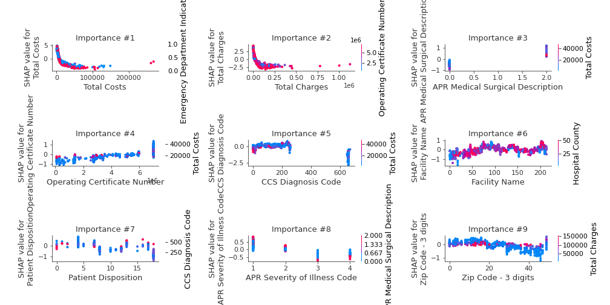

## SHAP Decision plots

### Top-10 Worst decisions for class 0 (Fold 1)
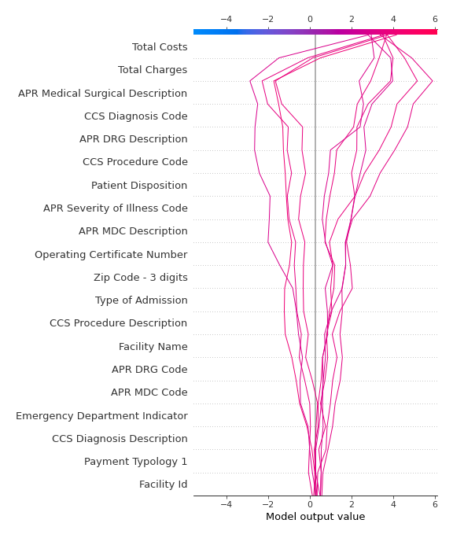
### Top-10 Best decisions for class 0 (Fold 1)
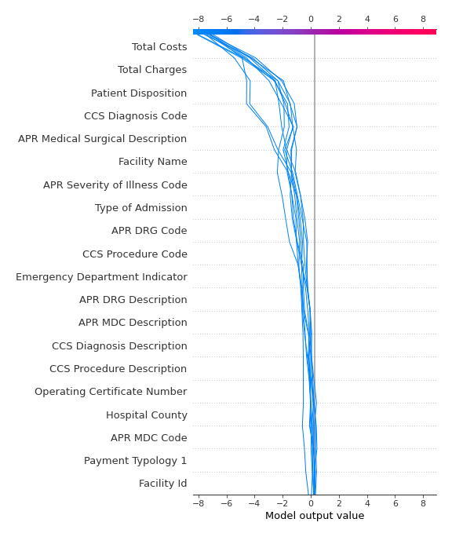
### Top-10 Worst decisions for class 1 (Fold 1)
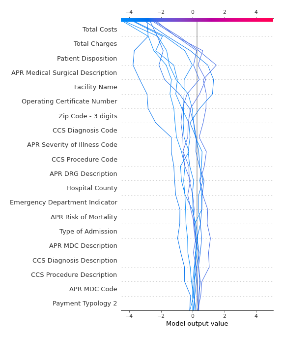
### Top-10 Best decisions for class 1 (Fold 1)
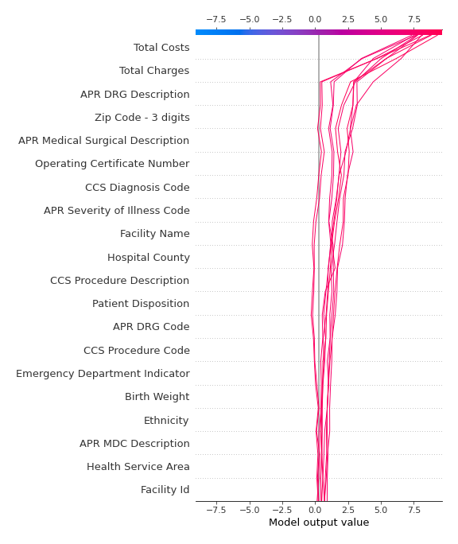

[<< Go back](../README.md)
