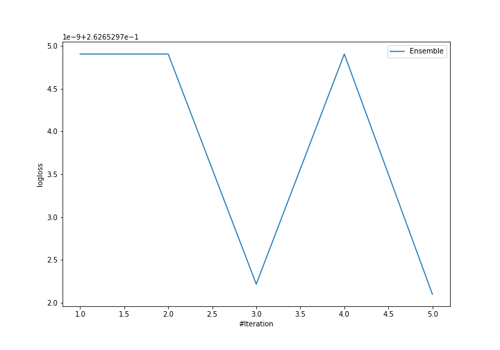
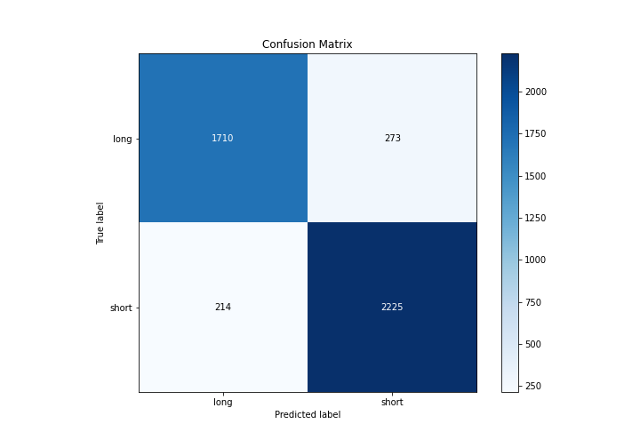
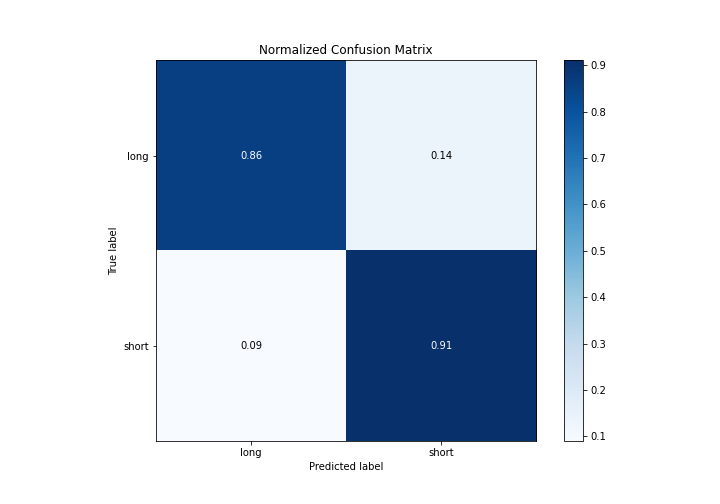
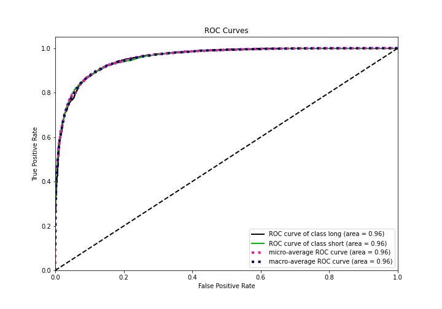
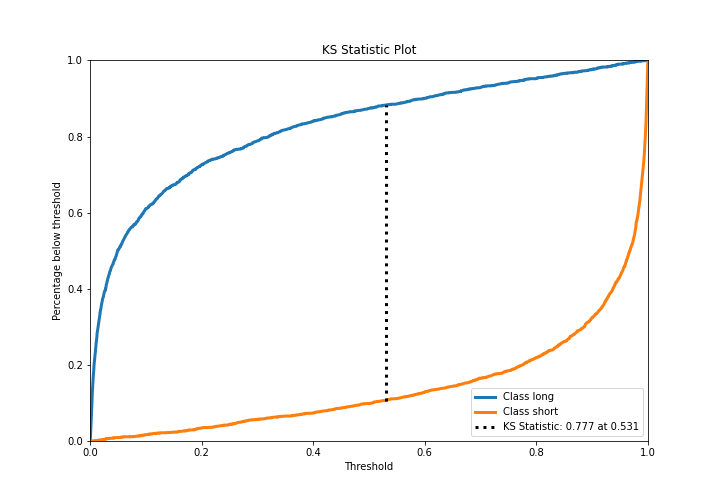
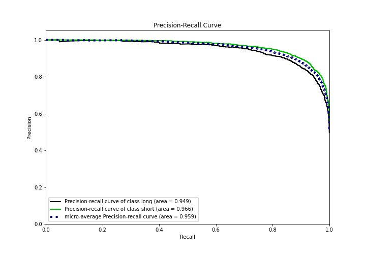
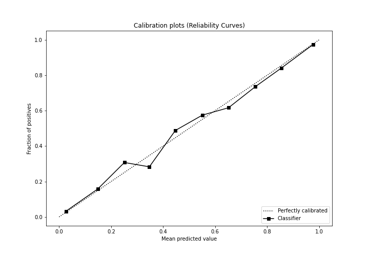
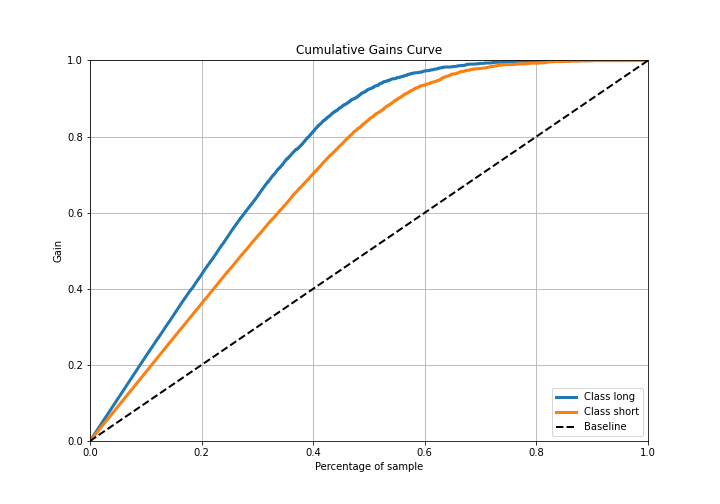
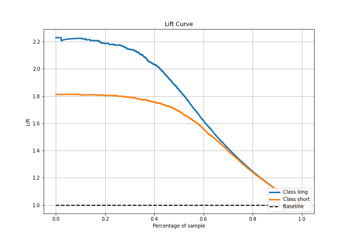

# Summary of Ensemble

[<< Go back](../README.md)

## Ensemble structure
| Model             |   Weight |
|:------------------|---------:|
| 3_Default_Xgboost |        5 |

## Metric details
|           |    score |    threshold |
|:----------|---------:|-------------:|
| logloss   | 0.262653 | nan          |
| auc       | 0.957581 | nan          |
| f1        | 0.901357 |   0.456346   |
| accuracy  | 0.889869 |   0.456346   |
| precision | 1        |   0.99804    |
| recall    | 1        |   0.00024779 |
| mcc       | 0.777034 |   0.456346   |

## Metric details with threshold from accuracy metric
|           |    score |   threshold |
|:----------|---------:|------------:|
| logloss   | 0.262653 |  nan        |
| auc       | 0.957581 |  nan        |
| f1        | 0.901357 |    0.456346 |
| accuracy  | 0.889869 |    0.456346 |
| precision | 0.890713 |    0.456346 |
| recall    | 0.912259 |    0.456346 |
| mcc       | 0.777034 |    0.456346 |

## Confusion matrix (at threshold=0.456346)
|                  |   Predicted as long |   Predicted as short |
|:-----------------|--------------------:|---------------------:|
| Labeled as long  |                1710 |                  273 |
| Labeled as short |                 214 |                 2225 |

## Learning curves

## Confusion Matrix

## Normalized Confusion Matrix

## ROC Curve

## Kolmogorov-Smirnov Statistic

## Precision-Recall Curve

## Calibration Curve

## Cumulative Gains Curve

## Lift Curve

[<< Go back](../README.md)
